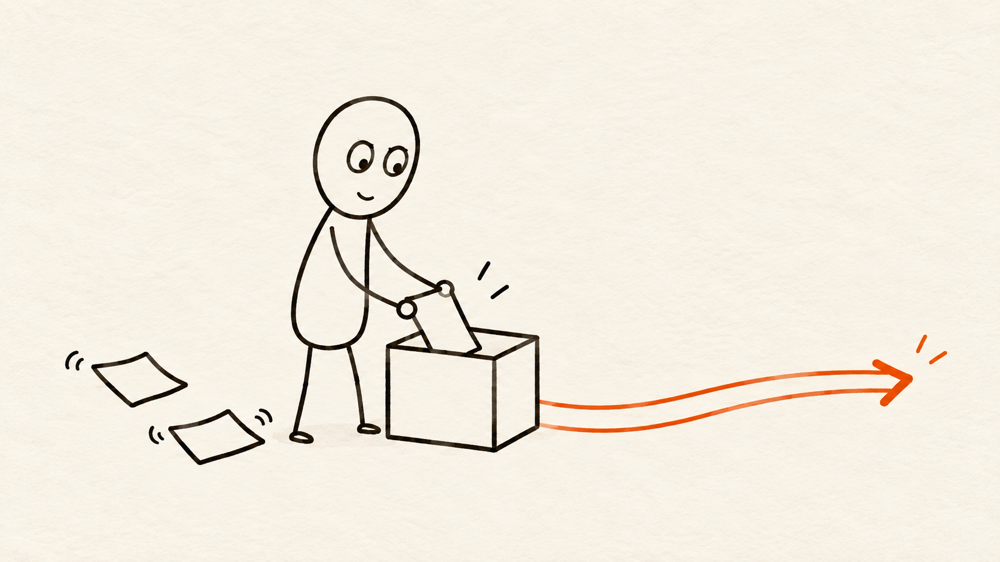

# 小token插画 Skill

用暖米白纸张和手绘线条小人“小token”，为中文文章、观点和角色设定制作插画。



## 能做什么

- 从文章中挑选值得配图的观点，先规划配图清单，或直接逐张生成正文配图。
- 将单个观点变成一张有动作的概念插画。
- 制作小token的正面、侧面、背面三视图，以及表情和动作图。
- 修改已有图片时保留角色比例、暖纸底色和未指定的内容。

默认正文配图为横向 16:9。小token的身体保持纸张底色，以深褐黑手绘线条勾勒；背景保留轻微暖纸纹理。仓库内含角色原稿、暖纸三视图和示例图，可直接作为 Skill 的视觉参考。

## 安装

仓库中需要安装的目录是 `xiao-token-illustrations/`。下载本仓库后，将该目录复制到 Codex 的 `skills` 目录：

```text
~/.codex/skills/xiao-token-illustrations/
```

Windows 默认位置为 `%USERPROFILE%\.codex\skills\xiao-token-illustrations\`。复制后重新打开 Codex，即可用 `$xiao-token-illustrations` 调用。

## 使用示例

```text
使用 $xiao-token-illustrations，为下面这篇文章挑选 4 个值得配图的观点，并逐张生成暖纸底色的小token正文配图：

<粘贴文章>
```

```text
使用 $xiao-token-illustrations，把“想法太多，需要先收拢再行动”画成一张横版正文配图，不要文字。
```

```text
使用 $xiao-token-illustrations，制作小token的正面、侧面、背面三视图，保持暖纸底色和手绘线条。
```

## 文件

- [`xiao-token-illustrations/SKILL.md`](xiao-token-illustrations/SKILL.md)：入口规则和工作流程。
- [`xiao-token-illustrations/references/`](xiao-token-illustrations/references/)：角色、构图、提示词与质检细则。
- [`xiao-token-illustrations/assets/`](xiao-token-illustrations/assets/)：角色原稿与暖纸三视图参考。
- [`examples/`](examples/)：生成效果示例，不作为固定构图模板。

## 来源与许可

文章配图的工作流借鉴并改编自 Ian 的 [Ian Xiaohei Illustrations](https://github.com/helloianneo/ian-xiaohei-illustrations)。小token是独立的线条角色；本仓库没有收录原项目的“小黑”角色图或示例图。详细出处见 [NOTICE.md](NOTICE.md)。

仓库全部内容，包括 Skill 文档、配置、角色原稿、三视图和示例图，均按 [MIT License](LICENSE) 开源。
